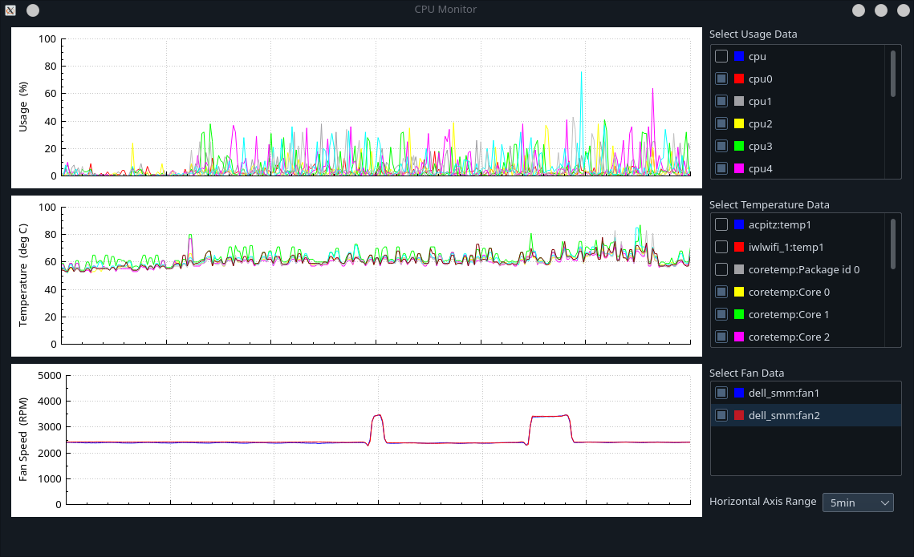

# About

A graphical frontend for `lmsensors` featuring efficient sensor data plotting in real time.



# Quick Start

Requirements: 
- `qt5-base`
- `qt5-tools`
- `lm_sensors`

Build:
```
$ qmake sysmonitor.pro
$ make
```

Run:
```
$ ./sysmonitor
```
